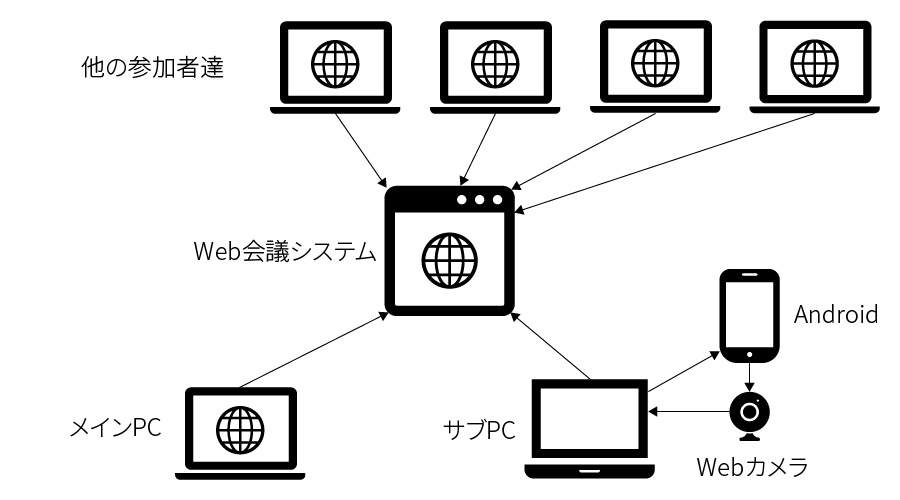
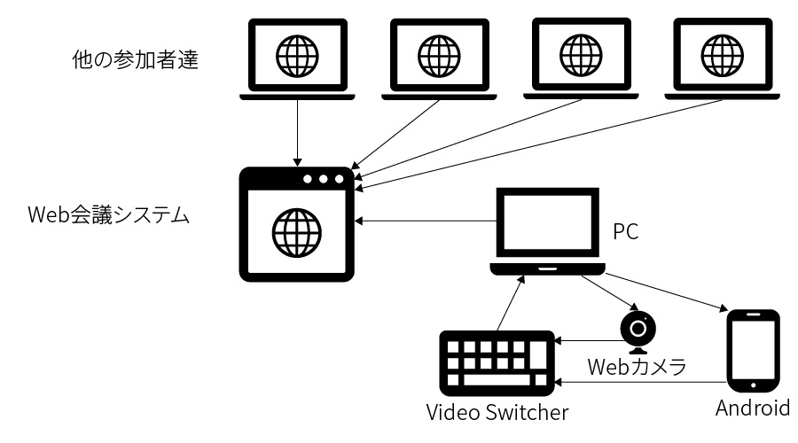
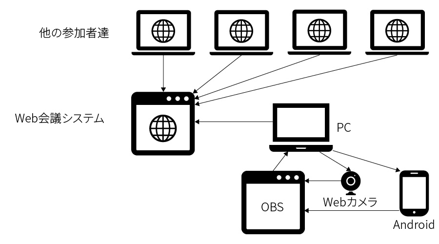

# Remote_Voice_Recognition
リモートミーティングでの音声認識の活用事例

## About / 概要
聴覚障害者は音声会話が難しく，会議にも参加しづらいという問題があり，音声認識による文字起こしを用いてこれを解消しようと研究や開発が行われています．2020年5月現在，新型コロナウイルスの流行により，Web会議システムを用いたリモート会議が会議のほとんどになりつつあります．しかし，聴覚障害者は通常の対面会議よりもさらに会話への参加がしづらいため，音声認識の活用がより重要になります．そこで，聴覚障害当事者と所属研究室のメンバーで考案した，リモート会議における音声認識の活用方法を紹介します．

##  方法
文字起こしの方法として，**リアルタイムで会話を展開**することを重視し， [Google 音声文字変換](https://play.google.com/store/apps/details?id=com.google.audio.hearing.visualization.accessibility.scribe&hl=ja)
による自動文字起こしを利用します．

自動文字起こしでは，リアルタイム性とのトレードオフとして誤変換が多く発生します．手動での修正は行わず，各自自動文字起こしに合わせて発言してもらうことにしました．文字起こしの結果は，聴覚障害者本人だけでなくWeb会議システム上に表示しているので，誤変換が発生した場合には発言しなおすなどの対応が可能です．  
Google 音声文字変換は，現状Android向けアプリのみで利用可能となっているため，Web会議システムの音声をどのようにアプリに送るか，認識結果をどのようにPCへ送るかを工夫する必要があります．そのシステム構成について，3つの方法を紹介します．  
しかし，Google 音声文字変換は，Androidにしか配布されていないアプリであるため，PCに音源を送信するかを考慮する必要があります．今回は考慮したシステム構成3つの活用事例で紹介します．  
  - [2台のPCを用いる方法](case/Using_2pc.md)
    - 手元に2台のPCがある方やもう1台のPCを追加用意できる方向けです．1台のPCになるべく負担をかけないようになっています．   
    
  - [ビデオスイッチャーを用いる方法](case/Using_VideoSwitcher.md)
    - 手元にビデオスイッチャーがある方向けです．1台のPCになるべく負担をかけないようになっています．  
    
  - [OBSの仮想カメラを用いる方法](case/Using_OBS.md)
    - なるべくハードウェア（製品）を追加で導入したくない方向けです．その代わり，1台のPCに負担をかかってしまいます．  
    

## 課題
### 1. 誤変換
Google音声文字変換は，文字起こし結果の手動修正ができないため，誤変換により会話内容の誤解を招くリスクがあります．そのようなリスクに抵抗を覚える方は，手動の修正が可能UDトークなどを利用することをおすすめします．なお，UDトークはAndroidだけでなくiOS（iPhoneやiPad）で利用することも可能です．また誤変換についてのサポートとしてスマートフォンを遠隔地側と手元側に複数台用意する事でよりロバストになります．

### 2. 話者の識別
Google 音声文字変換は，誰が発言したのかを掴みにくいという問題があります．そのため，下記の対応を取っています．
  - ZoomやGoogle Meetでは，発言者の画面枠に自動で色がつくので，それで判断する
  - 議事録では，誰かが発言したのかわかるようにできるだけ残す
    - 例：（設楽）今日の議題については…

また話者側に音声文字変換を重ねてもらうようにすると発言が他の人と混ざらないので認識しやすいかもしれません．授業をする側の先生やワークショップのファシリテーションをする側には字幕の仕組みを導入するとコミュニケーションがスムーズです．

### 3. 発言方法
私は発言する際に，基本的に音声（口話）で話していますが，音声で話したくない or 話せない人はどのように発言すればよいかという議論があります．**チャットもしくは手話通訳の配置**が考えられますが，第一言語である手話で自然と発言ができるようになる方法がないものか…と考えています．

ZOOMなどを利用する際はリアクションボタンがある程度役に立ちますが，未だ視認性がどうしても低いという問題があります．

### 4. 呼びかけ
会議などの議論のなかで，誰かを名前で呼ぶことが聴者文化では一般的ですが，聴覚障害者のうち　手話を主に用いるろう者は，手を振るなどで対応するろう文化を身についています．しかし，聴者とろう者が混ざっている会議では，次のような問題があり，呼びかけに気づかないことが多々ありました．
- 私を呼びかけるために手を振ってきたのか？それとも，単純に動いているだけなのか？がわからない
- 私の名前が文字起こしで出てきたから私のことを呼んでいるのか？それとも誤変換で偶然出てきてしまっただけなのか？がわからない

そこで，私の研究室では，誤変換されにくく簡単に言いやすい単語として**アンパンマン**と変換されたら私のことを呼んでいるというルールを設けて対応しています． 
   - 候補に挙がった語一覧
      - アンパンマン
      - バイキンマン
      - ゼータガンダム
      - スポンジボブ
      **（カタカナの固有名詞で三音節以上で言いやすいものなど，特別に認識しやすい単語があります．探してみてください）**

他に音声変換のキャッシュが溜まると変換精度が下がることが見られるため（後述します）
アプリの**キャッシュを空にする手話は皆が覚えました．

また，Slackでメンションを飛ばしてもらうことで呼びかけを行うこともあります．

### 5. ハードウェア（製品）  
今回用意したハードウェア（製品）は，PCと比べて一般的に用いるようなものではなく，音楽や映像配信などを行う人が用いるような製品です．手元にない方は新しく購入する必要がありますが，やや高価です．また，新型コロナウイルスの影響により需要が増加しており，在庫が不足しているものも多く，すぐに手に入れることが難しい状況になっています．しかし，[この記事](https://konnnnnok.hateblo.jp/entry/2020/05/15/004822)に記載されている，**Sound Blaster PLAY! 3**，[東京大学PHEDのAT(支援機器)ライブラリ](https://phed.jp/at/)にて紹介されている，**iRig 2**は安価です．各自に適した仕様を持ち合わせたオーディオインターフェースを探せば，安価で購入することも可能です．  
  - [Creative社 **Sound Blaster PLAY! 3**](https://jp.creative.com/p/sound-blaster/sound-blaster-play-3)
  - [IK Multimedia社 **iRig 2**](https://hookup.co.jp/products/ik-multimedia/irig-2)
    - [IK Multimedia : iRIG 2のAndroid対応デバイスについて](https://hookup.co.jp/support/posts/4355)

  
### 6. アプリの安定性とネットワーク
1時間ほどで使い続けていると，誤変換が増えていきます．アプリのキャッシュをクリアしたり，アプリを再起動したりすると元に戻ります．また，音声文字変換のアプリではインターネット接続が必須です．それだけではなく，一般的なWeb会議でも回線を圧迫することがあるため，日本語でもオフラインで認識することが可能になれば，ネットワーク問題については解消されるので，Googleのアップデートに期待しています．   
注) Google 音声文字変換は，Pixel系スマートフォン利用かつ英語の文字認識であれば，オフラインで認識されるようになっています．（ソース：[Googleの新音声認識はオフライン化されて高速に、Pixelで利用可能](https://jp.techcrunch.com/2019/03/13/2019-03-12-googles-new-voice-recognition-system-works-instantly-and-offline-if-you-have-a-pixel/)）

### 7. 目への負担
音声認識による文字起こし，話者の画面などと目を動かしながら，長時間見続けるのは，意外と目に負担がかかります．実際に私も1時間ほどのミーティングを３連続で続けていると圧倒的な疲労感が襲ってきたこともありました．ですので，目への負担を考慮しながら適宜休憩を入れることを推奨いたします．また，下記の記事でも考慮すべきことをまとめてありますので，ご参考ください．  
[ろう・難聴学生が「目」の健康を保つための６つのポイント－オンライン授業の受講に向けて－｜松﨑　丈 #note](https://note.com/matsuzakijo/n/n0ca76c69a28e)
