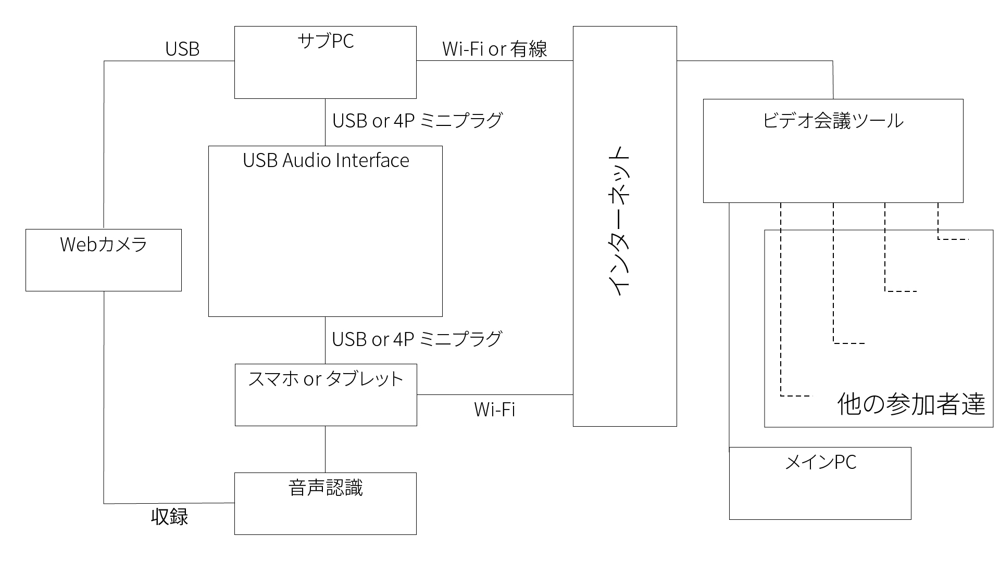
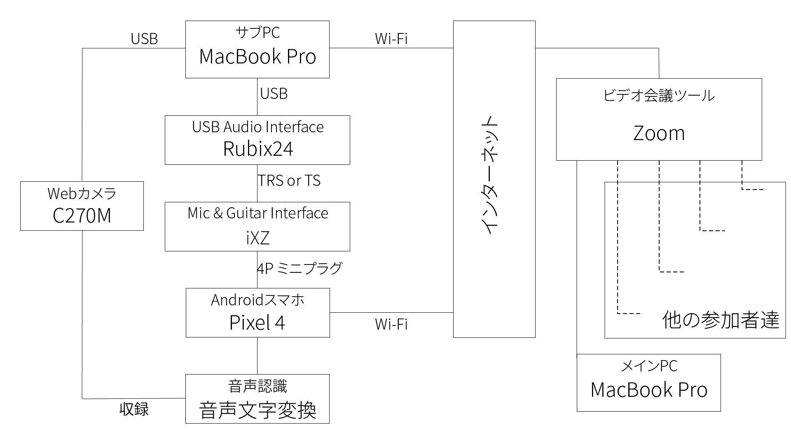

# 2台のPCを用いる方法
音声認識を活用する用PC，自分が参加する用PCの2台で活用する方法です．
この方法で実施するためのシステム構成は下記の図の通りになります．

なお，テンプレートのデータを配布していますので，各自マニュアル作成などに役に立てれば嬉しいです．
  - [JPG形式データ（画像）](fig/template/Template_Using_2pc-JP.jpg)
  - [AI形式データ（Illustratorなどで用いるデータ）](fig/template/Template_Using_2pc-JP.ai)

## 所属研究室にて用いたシステム構成

- 用いた機器リスト
  |機器名|目的|
  |:---:|:---|
  |[MacBook Pro 2019 13インチ](https://support.apple.com/kb/SP795?viewlocale=ja_JP&locale=ja_JP)|音声認識を活用するPC|
  |[Roland Rubix24](https://www.roland.com/jp/products/rubix24/)|USB Audio Interface|
  |[Google Pixel 4](https://store.google.com/jp/product/pixel_4)|Google 音声文字変換を用いるAndroid|
  |[TASCAM iXZ](https://tascam.jp/jp/product/ixz/top)|USB Audio InterfaceからAndroidに接続するための変換インターフェース|
  |[logicool HD WEBCAM C270M](https://www.logicool.co.jp/ja-jp/product/hd-webcam-c270h#specification-tabular)|音声認識による文字起こしを収録するWebカメラ|
  
## 接続様子
1. 全ての機器を接続する

    1. サブPCのMacBook ProにRubixを接続する  
      
    1. AndroidスマホのPixel 4にiXZを接続した上で，RubixとiXZを接続する  
      
    1. サブPCにWebカメラのC270Mを接続する  
      
        ※Androidスマホ画面が入るようにするために三脚などを工夫して用いることを推奨します
    

1. Web会議システムのZoomを起動する
    1. 音声認識の音声文字変換を起動する
    1. Pixel 4の画面をWebカメラで収録する
        1. スピーカーの出力装置を選択する  
      
        1. ビデオの出力装置を選択する  
    
    
    
1. メインPCでZoomを起動して終わり
