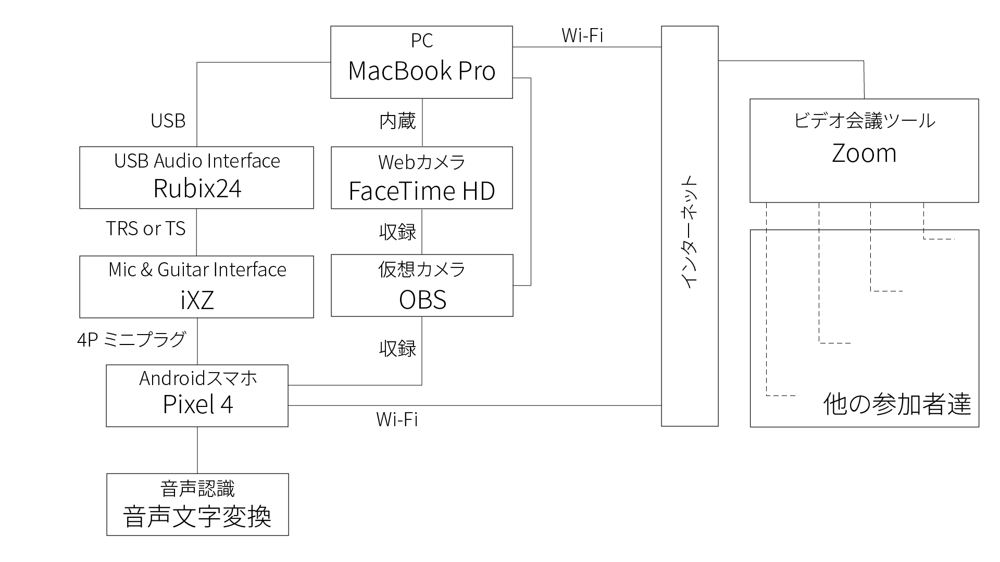
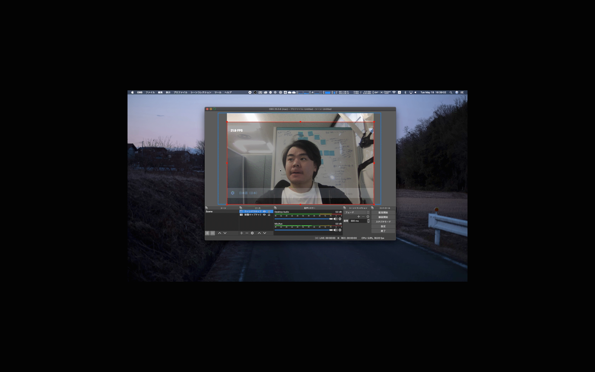

# OBSの仮想カメラを用いる方法
なるべくハードウェア（製品）を追加で導入しないで，音声認識を活用する方法です．
この方法で実施するためのシステム構成は下記の図の通りになります．

なお，テンプレートのデータを配布していますので，各自マニュアル作成などに役に立てれば嬉しいです．
  - [JPG形式データ（画像）](fig/template/Template_Using_OBS-JP.jpg)
  - [AI形式データ（Illustratorなどで用いるデータ）](fig/template/Template_Using_OBS-JP.ai)

## 所属研究室にて用いたシステム構成

- 用いた機器リスト
  |機器名|目的|
  |:---:|:---|
  |[MacBook Pro 2019 13インチ](https://support.apple.com/kb/SP795?viewlocale=ja_JP&locale=ja_JP)|音声認識を活用するPC|
  |[Roland Rubix24](https://www.roland.com/jp/products/rubix24/)|USB Audio Interface|
  |[Google Pixel 4](https://store.google.com/jp/product/pixel_4)|Google 音声文字変換を用いるAndroid|
  |[TASCAM iXZ](https://tascam.jp/jp/product/ixz/top)|USB Audio InterfaceからAndroidに接続するための変換インターフェース|

  
## 接続様子
1. 全ての機器を接続する

    1. サブPCのMacBook ProにRubixを接続する  
      
    1. AndroidスマホのPixel 4にiXZを接続した上で，RubixとiXZを接続する  
      

1. Web会議システムのZoomを起動する
    1. 音声認識の音声文字変換を起動する
    1. OBSを起動し，仮想カメラ機能を用いて，Pixel 4の画面を収録する
        1. Android画面を出力（ミラーリング）します．なお，下記の３通りから選択して実施してください（やり方については各公式ホームページにて説明されています）
            - [AirServer](https://www.airserver.com)
                - PCにダウンロード&インストールを済ませる
                1. AirServerをPCにて起動する
                1. Androidでミラーリング出力する
            - [ApowerMirror](https://www.apowersoft.jp/phone-mirror)
                - PC，Androidの両方にダウンロード&インストールを済ませる
                1. PCとAndroidをUSBで接続するもしくは同じWi-Fiに予め接続する
                1. PCにてApowerMirrorを起動する
                1. AndroidでApowerMirrorを起動し，ミラーリング出力する
            この[OBS-Mac-Vitrualcam](https://github.com/johnboiles/obs-mac-virtualcam#installing)にて説明されているので，参考しながら，予めインストールしておくと楽になります．  
             - [OSがWindowsの方はこちらを参考していただけると嬉しいです．](https://github.com/CatxFish/obs-virtual-cam/releases)
        1. OBSを起動し，内蔵カメラをビデオキャプチャする  
            
        1. 出力したAndroid画面をウィンドウキャプチャする  
            
        1. ウィンドウキャプチャしたAndroid画面にクロキーフィルタを通して，透明度を調整する  
            
    1. OBSの仮想カメラ機能をスタートさせる
        
    1. ZoomをGoogle Chromeで開き，ビデオをOBSの仮想カメラに設定する
        

    
    
