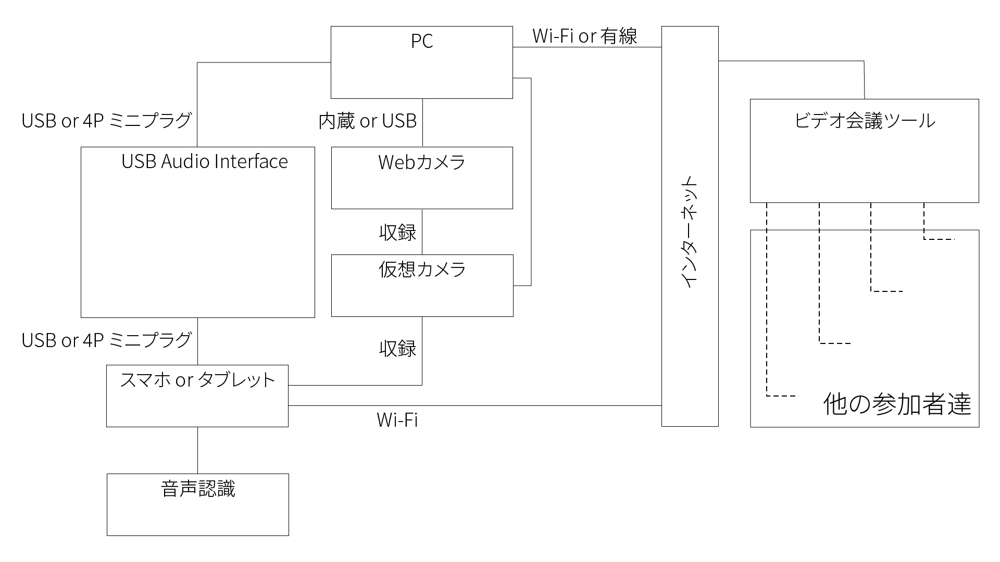
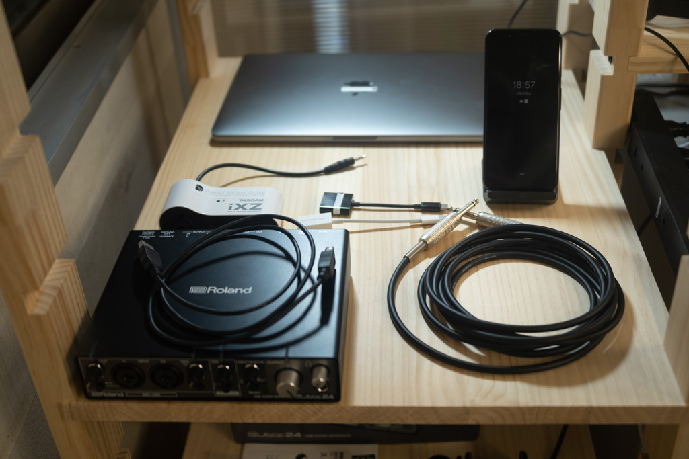
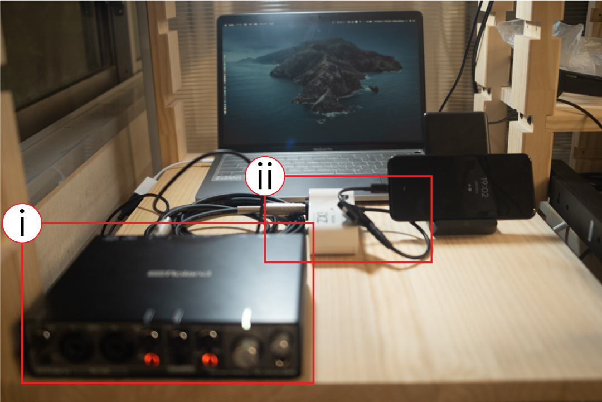
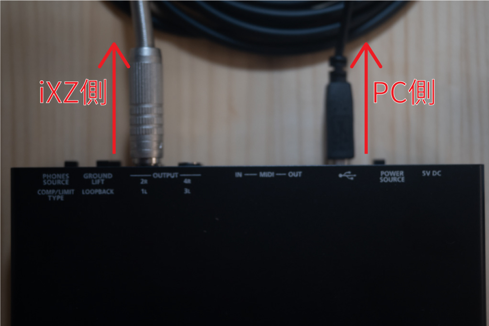
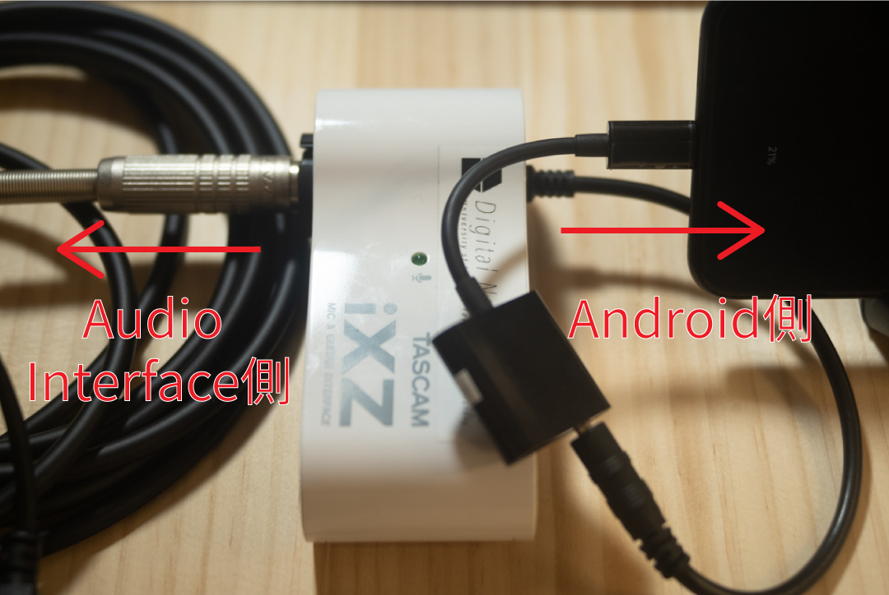
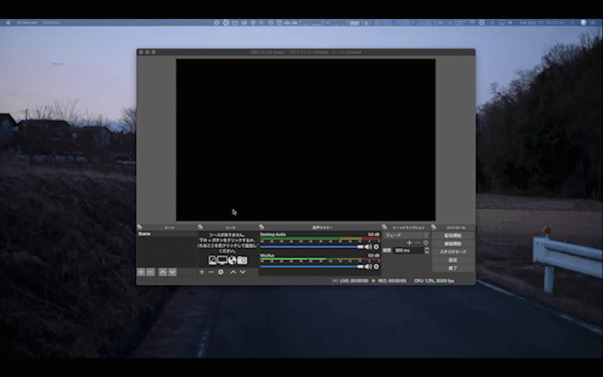
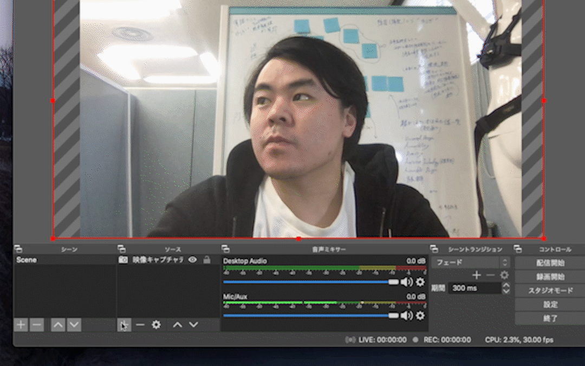
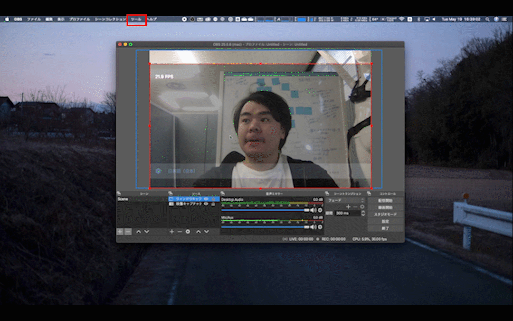
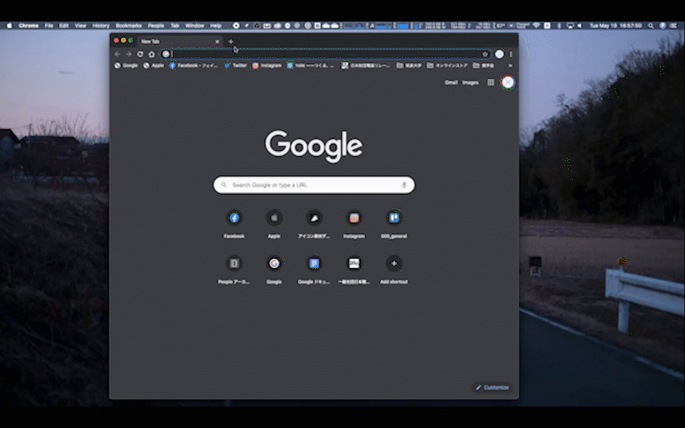

# OBSの仮想カメラを用いる方法
なるべくハードウェア（製品）を追加で導入しないで，音声認識を活用する方法です．
この方法で実施するためのシステム構成は下記の図の通りになります．

なお，テンプレートのデータを配布していますので，各自マニュアル作成などに役に立てれば嬉しいです．
  - [JPG形式データ（画像）](fig/template/Template_Using_OBS-JP.jpg)
  - [AI形式データ（Illustratorなどで用いるデータ）](fig/template/Template_Using_OBS-JP.ai)

## 所属研究室にて用いたシステム構成

- 用いた機器リスト
  |機器名|目的|
  |:---:|:---|
  |[MacBook Pro 2019 13インチ](https://support.apple.com/kb/SP795?viewlocale=ja_JP&locale=ja_JP)|音声認識を活用するPC|
  |[Roland Rubix24](https://www.roland.com/jp/products/rubix24/)|USB Audio Interface|
  |[Google Pixel 4](https://store.google.com/jp/product/pixel_4)|Google 音声文字変換を用いるAndroid|
  |[TASCAM iXZ](https://tascam.jp/jp/product/ixz/top)|USB Audio InterfaceからAndroidに接続するための変換インターフェース|

  
## 接続様子
1. 全ての機器を接続する

    1. サブPCのMacBook ProにRubixを接続する  
        
        1. MacBook ProとRubixをUSBケーブルで接続する（USB-TypeC 変換アダプタを用いました）
        1. 予め，iXZと接続するためのTRケーブルを差し込んでおく
    1. AndroidスマホのPixel 4にiXZを接続した上で，RubixとiXZを接続する  
       
        1. ⅰのaで予め差し込んだTRケーブルでiXZに接続する
        1. AndroidスマホとiXZを4Pミニプラグで接続する（4Pミニプラグ to USB-TypeC 変換アダプタを用いました）

1. Web会議システムのZoomを起動する
    1. 音声認識の音声文字変換を起動する
         
        1. スピーカーの出力装置を選択する  
            1. マイクのアイコンの右上にある**矢印**をクリックする
            1. スピーカーの部分にある，**オーディオインターフェースのRubix**を選択する
            1. 起動した音声文字変換の設定画面にて，オーディオインターフェースと接続されているか確認する
    
    1. OBSを起動し，仮想カメラ機能を用いて，Pixel 4の画面を収録する
        1. Android画面を出力（ミラーリング）します．なお，下記の３通りから選択して実施してください（やり方については各公式ホームページにて説明されています）
            - [AirServer](https://www.airserver.com)
                - PCにダウンロード&インストールを済ませる
                1. AirServerをPCにて起動する
                1. Androidでミラーリング出力する
            - [ApowerMirror](https://www.apowersoft.jp/phone-mirror)
                - PC，Androidの両方にダウンロード&インストールを済ませる
                1. PCとAndroidをUSBで接続するもしくは同じWi-Fiに予め接続する
                1. PCにてApowerMirrorを起動する
                1. AndroidでApowerMirrorを起動し，ミラーリング出力する  
            この[OBS-Mac-Vitrualcam](https://github.com/johnboiles/obs-mac-virtualcam#installing)にて説明されているので，参考しながら，予めインストールしておくと楽になります．  
             - OSがWindowsの方は[こちら](https://github.com/CatxFish/obs-virtual-cam/releases)を参考していただけると嬉しいです．
        1. OBSを起動し，内蔵カメラをビデオキャプチャする    
              
            1. ソースの下にある**＋**をクリックする
            1. 表示された一覧から**映像キャプチャデバイス**を選択する
            1. 表示された画面にある**OK**をクリックする
            1. 次に表示された画面にある**デバイス**をクリックする
            1. 表示された一覧から**内蔵カメラ（FaceTime HD Camera (Built-in)）**を選択する
            1. **OK**をクリックし，閉じる
            1. サイズと位置を調整する 
                 ※Macではサイズ変更する際に，赤い点をoptionキーを押しながらクリックしている状態で動かせば，大きく小さくとできます
        1. 出力したAndroid画面をウィンドウキャプチャする    
              
            1. 再びソースの下にある**＋**をクリックする
            1. 表示された一覧から**ウィンドキャプチャ**を選択する
            1. 表示された画面にある**OK**をクリックする
            1. 次に表示された画面にある**［AirServer］Pixel 4・・・**をクリックする
            1. OKをクリックし，閉じる
            1. サイズと位置を調整する  
                ※Macではサイズ変更する際に，赤い点をoptionキーを押しながらクリックしている状態で動かせば，大きく小さくとできます
        1. ウィンドキャプチャしたAndroid画面にカラーキーフィルタで背景を透明化する   
              
            1. cにて作られたウィンドウキャプチャを右クリックメニューで開く
            1. 開いた右クリックメニューから**フィルタ**を選択する
            1. 表示された画面にある**エフェクトフィルタ**の下にある＋をクリックする
            1. 表示された一覧にある**カラーキー**をクリックする
            1. cの表示された画面にカラーキーのパラメータ画面が表示されているので，その中にある**色キーの種類**をクリックする
            1. 表示された一覧にある**カスタム色**を選択する
            1. **色を選択**をクリックする
            1. 色のパネル画面が表示されるので，その中にある**原色の黒**を選択する
            1. **OK**をクリックし，閉じる
            1. 最後に**閉じる**をクリックし，閉じる
            
    1. OBSの仮想カメラ機能をスタートさせる
        
          1. メニューバーにある**ツール**をクリックする
          1. 表示された一覧から**Start Virtual Camera**をクリックする
          
    1. ZoomをGoogle Chromeで開き，ビデオをOBSの仮想カメラに設定する
        
          1. Zoomのミーティング共有URLをGoogle Chromeにて開く
          1. アプリケーションにて開くかどうか確認画面が表示されるので，**キャンセル**をクリックする
          1. **ここをクリック**をクリックし，再びbの確認画面が表示されるので，また**キャンセル**をクリックする
          1. 小さい文章「ダウンロードできませんか？こちらをクリックして開始することもできます。」が表示されるので，その文章にある**こちら**をクリックする
          1. しばらくしたら開始されるので，待機する（黒い画面からZoom画面に変わる）
          1. ビデオのアイコンの右にある**矢印**をクリックする
          1. 表示された一覧にある**OBS Virtual Camera Device**を選択する
          
    1. これで表示されます

    
    
