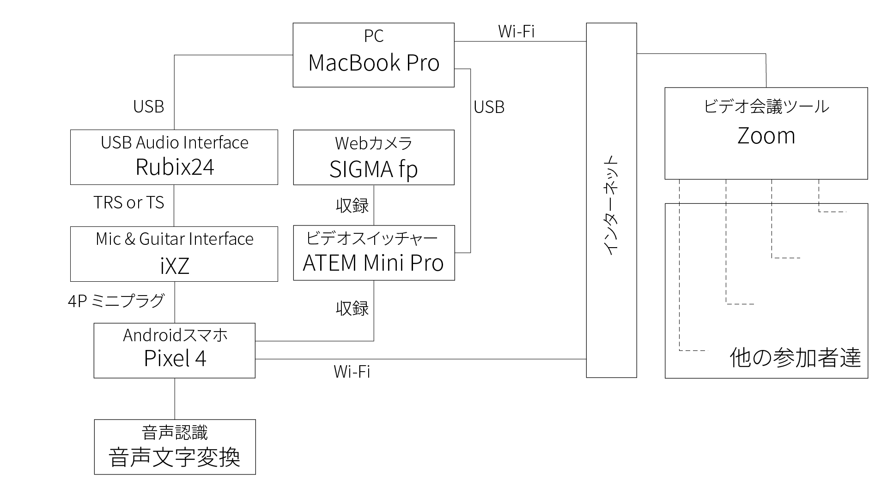

# ビデオスイッチャーを用いる方法
ビデオスイッチャーを用いて，音声認識を活用する方法です．なお，1台のPCになるべく負担をかけないようになっています．
まだ，検討段階ですが，ご参考にしていただければ幸いです．
この方法で実施するためのシステム構成は下記の図の通りになります．

なお，テンプレートのデータを配布していますので，各自マニュアル作成などに役に立てれば嬉しいです．
  - [JPG形式データ（画像）](fig/template/Template_Using_VideoSwitcher-JP.jpg)
  - [AI形式データ（Illustratorなどで用いるデータ）](fig/template/Template_Using_VideoSwitcher-JP.ai)

## 所属研究室にて用いるシステム構成

- 用いる予定の機器リスト
  |機器名|目的|
  |:---:|:---|
  |[MacBook Pro 2019 13インチ](https://support.apple.com/kb/SP795?viewlocale=ja_JP&locale=ja_JP)|音声認識を活用するPC|
  |[Roland Rubix24](https://www.roland.com/jp/products/rubix24/)|USB Audio Interface|
  |[Google Pixel 4](https://store.google.com/jp/product/pixel_4)|Google 音声文字変換を用いるAndroid|
  |[TASCAM iXZ](https://tascam.jp/jp/product/ixz/top)|USB Audio InterfaceからAndroidに接続するための変換インターフェース|
  |[SIGMA fp](https://www.sigma-global.com/jp/cameras/fp-series/)|自分の様子を撮影するカメラ|
  |[Blackmagicdesign ATEM Mini Pro](https://www.blackmagicdesign.com/jp/products/atemmini/techspecs/W-APS-14)|ピクチャー・イン・ピクチャー機能が搭載されているビデオスイッチャー|
  |[Google Chromecast](https://store.google.com/jp/product/chromecast)|Androidのミラーリング用キャスト|
  

  
## 接続様子
1. 全ての機器を接続する
    1. PCのMacBook ProにRubixを接続する  
      
    1. AndroidスマホのPixel 4にiXZを接続した上で，RubixとiXZを接続する  
      
    1. ATEM Mini ProにカメラのSIGMA fp，Google Chromecastを接続する

1. Web会議システムのZoomを起動する    
    1. 音声認識の音声文字変換を起動する
    1. ATEM Mini Proのピクチャー・イン・ピクチャー機能でサイズや位置，透明度などを調整する
    1. ZoomのビデオをATEM Mini Proに指定する
    1. ZoomのスピーカーをRubixを指定する
    
