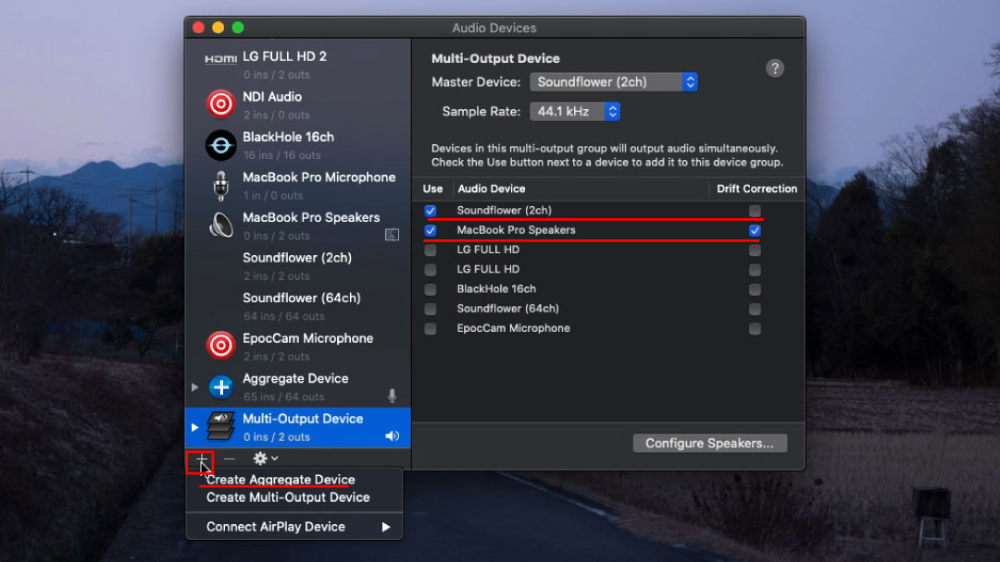
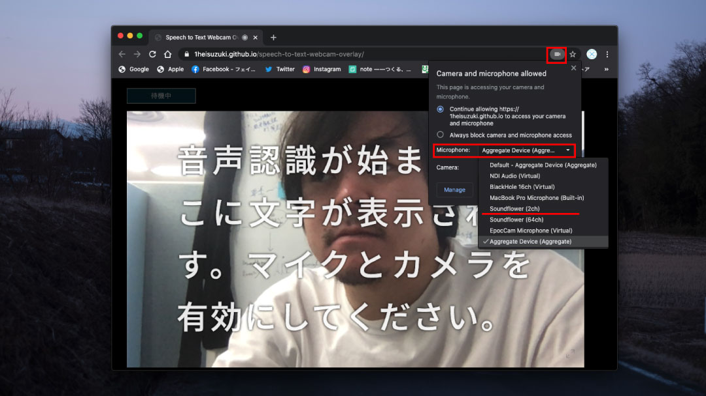
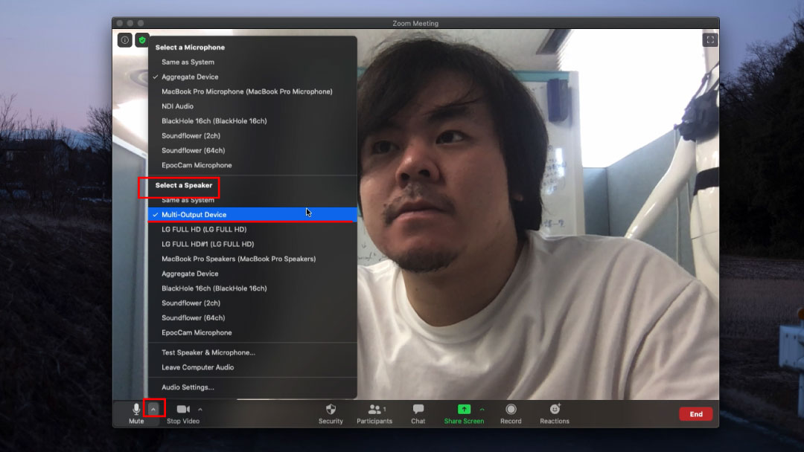
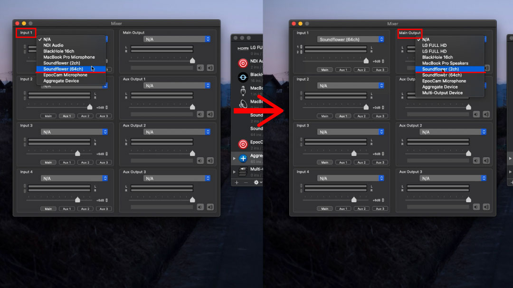

# オーディオインターフェースを用いない方法
所属研究室の鈴木一平さんが開発した，[**Webカメラの映像に自動字幕を重ねるWebページ**](https://github.com/1heisuzuki/speech-to-text-webcam-overlay)では，自分の音声しか認識できない問題があります．
ハードウェアのオーディオインターフェースを用意することで，相手の音声を認識することが可能になります．
しかし，オーディオインターフェースを用意できない方はどうすれば良いかわからない問題があります．
そこで，オーディオインターフェースを用いない代わり仮想オーディオインターフェースを用いて認識する方法の2つのパターンを紹介します．

## 自分の音声を認識しないで相手（参加者の皆さん）の音声を認識する方法
1. [Soundflower](https://github.com/mattingalls/Soundflower/releases/tag/2.0b2)をダウンロード&インストールする  
1. Audio MIDI Setupを起動する（音声を聞くためにスピーカーも用いたい方向けです．スピーカー不要な方は飛ばして構いません．）  
    1. Muliti-Output Deviceを作成する  
        
        1. **＋**をクリックし，**Muliti-Output Devic**を選択する
        1. Muliti-Output Deviceの設定画面で使うデバイスにチェックを入れる  
              1. Soundflower (2ch) ，MacBook Pro Speakersの2つ  

1. Webカメラの映像に自動字幕を重ねるWebページを起動する  
        
    1. マイク入力をSoundflower (2ch)に設定する  

1. Web会議システムのZoomを起動する  
    1. スピーカー（出力）を2のⅰにて作成したMulti-Output Deviceに設定する  
        
          1. スピーカーを用いない方は，Soundflower (2ch)に設定してください  
 

## 自分，相手（参加者の皆さん）の音声を認識する方法
1. [Soundflower](https://github.com/mattingalls/Soundflower/releases/tag/2.0b2)と[LadioCast](https://apps.apple.com/jp/app/ladiocast/id411213048?mt=12)をダウンロード&インストールする

1. Audio MIDI Setupを起動する
    1. Muliti-Output Deviceの作成（音声を聞くためにスピーカーも用いたい方向けです．スピーカー不要な方は飛ばして構いません．）  
        
        1. **＋**をクリックし，**Muliti-Output Devic**を選択する
        1. Muliti-Output Deviceの設定画面で使うデバイスにチェックを入れる  
              1. Soundflower (2ch) ，MacBook Pro Speakersの2つ  
             
    1. Aggregate Deviceの作成  
      
        1. **＋**をクリックし，**Create Aggregate Device**を選択する
        1. Aggregate Deviceの設定画面で使うデバイスにチェックを入れる  
            1. Soundflower (64ch) ，MacBook Pro Microphoneの2つ  
            
1. LabioCastを起動する  
    1. Soundflower (2ch) からSoundflower (64ch)へルーティング（転送）するように設定する  
      
        1. Input 1の部分にあるN/Aをクリックする
        1. **Soundflowre (64ch)**を選択する
        1. Main Outputの部分にあるN/Aをクリックする
        1. **Soundflowre (2ch)**を選択する
    
1. Webカメラの映像に自動字幕を重ねるWebページを起動する  
      
    1. マイク入力をAggregate Deviceに設定する  

1. Web会議システムのZoomを起動する  
    1. スピーカー（出力）を2のⅰにて作成したMulti-Output Deviceに設定する  
        
          1. スピーカーを用いない方は，Soundflower (2ch)に設定してください  

**Soundfolower**だけではなく，**BlackHole**もあります．
[BlackHole](https://github.com/ExistentialAudio/BlackHole)

また，仮想オーディオとルーティングを一緒に実施できるソフトもありますが，課金制となっております．
[Loopback](https://rogueamoeba.com/loopback/)

##参考資料
1. [【Mac】Soundflowerのインストールと使い方・設定まとめ](https://appli-world.jp/posts/2831)
1. [Macのサウンドを自由にルーティング/配信する　Soundflower / LadioCast の使い方](https://sleepfreaks-dtm.com/dtm-materials/mac-sound/)
1. [最新のmacOSに対応し、SoundFlowerのように仮想オーディオ入出力を作成できるオープンソースのユーティリティ「BlackHole」がリリース。](https://applech2.com/archives/20191125-blackhole-for-mac-virtual-audio-driver-soundflower-alternative-app.html)
